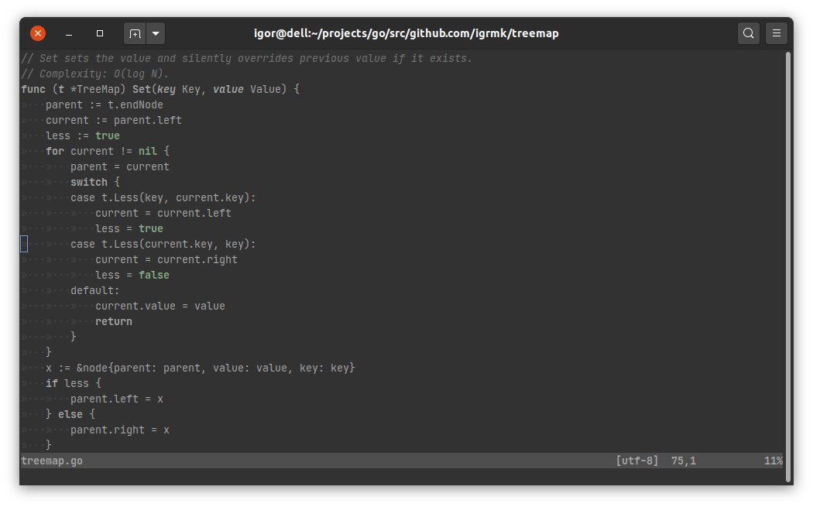
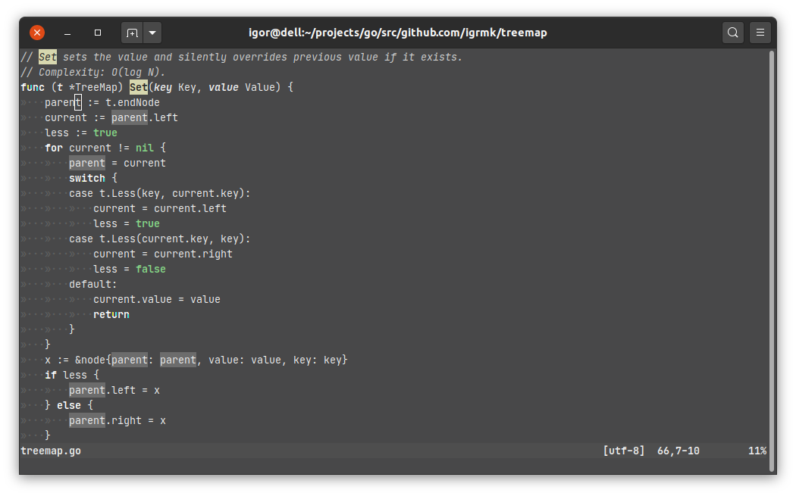

# KULL & HULL

- Modified fork of skull-vim
- Mostly monochrome-ish and green theme
- Bright variant **hull** for working under direct sunlight

## kull



## hull



## Installation

Install manually or use a package manager:

```viml
" vim-plug
Plug 'igrmk/kull-vim'
" NeoBundle
NeoBundle 'igrmk/kull-vim'
" Vundle
Plugin 'igrmk/kull-vim'

" kull
colorscheme kull
" hull
colorscheme hull
```

## Tips for working on plain air

1. Wear dark.
   Your screen will reflect your bright clothes.
   Even a matte display won't help if the sun will be shining on your white T-shirt.
2. Try to find a shadow.
   But try to not use trees.
   A lot of trees produce tiny drops of a resin.
   They are hard to clean from your screen.
3. Set the brightness level to the maximum.
4. Have a cleaning cloth with you. A dust is very distracting in the sun.
5. Try [garlic](https://github.com/igrmk/garlic) theme for GNOME Terminal and [Helsing](https://github.com/igrmk/helsing) theme for JetBrains products.
