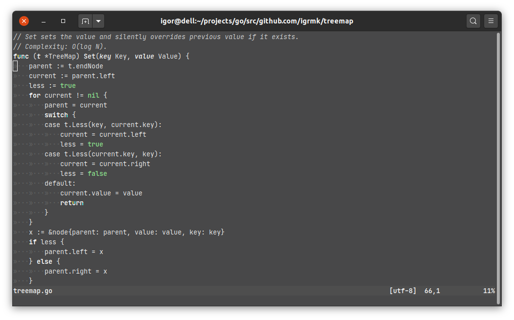

# KULL

- Modified fork of skull-vim
- Mostly monochrome-ish and green theme
- Bright variant **hull** for working under direct sunlight

## kull


## hull



## Installation

Install manually or use a package manager:

```viml
" vim-plug
Plug 'igrmk/kull-vim'
" NeoBundle
NeoBundle 'igrmk/kull-vim'
" Vundle
Plugin 'igrmk/kull-vim'

colorscheme kull
```
